# GitLab OpenClaw B 端中台

基于 **OpenClaw（小龙虾）Agent 框架** 的 GitLab 中台管理系统。接收 GitLab Webhook，按 Agent 模板自动调度 OpenClaw Agent，完成 Issue 状态流转、自动开发、MR 创建与会话追踪。

## 截图展示

> 所有截图源文件见 [`snap/`](./snap/) 目录。

### 仪表盘

<p align="center">
  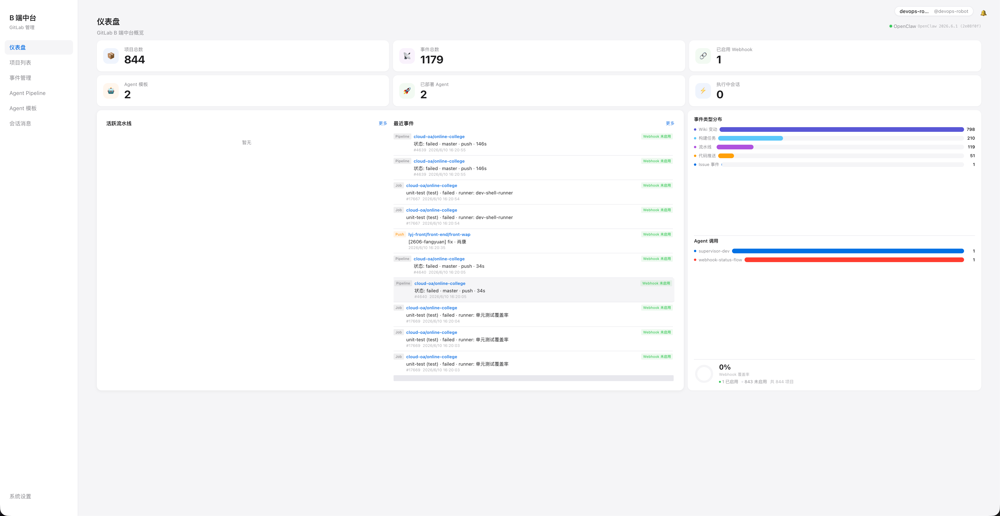
</p>

<p align="center">
  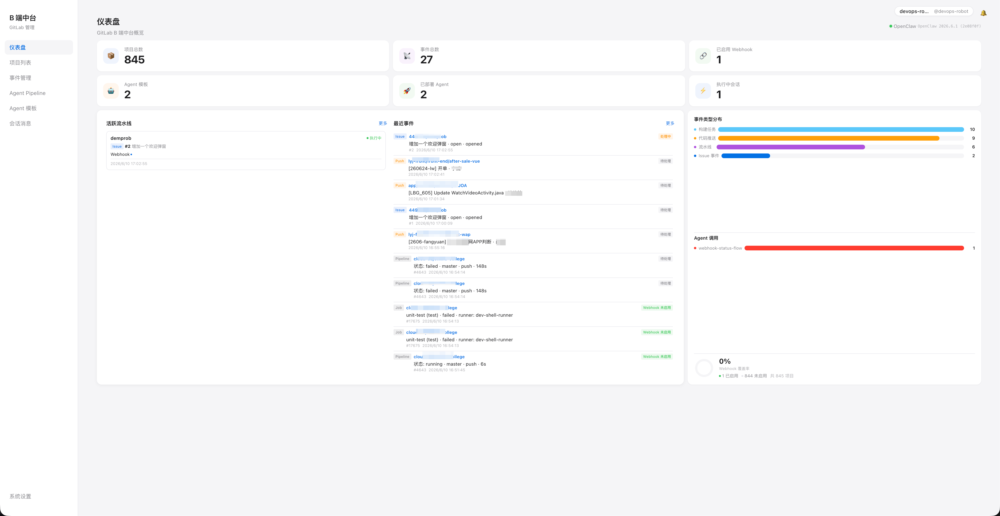
</p>

### Agent 模板

<p align="center">
  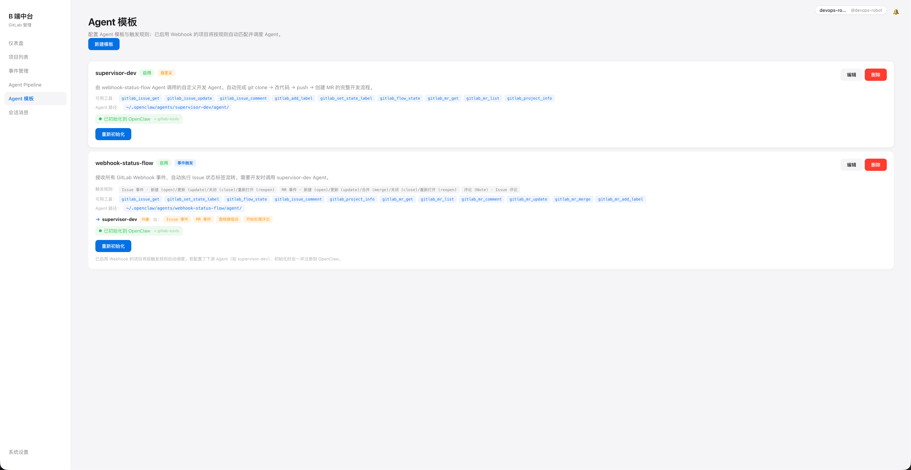
</p>

<p align="center">
  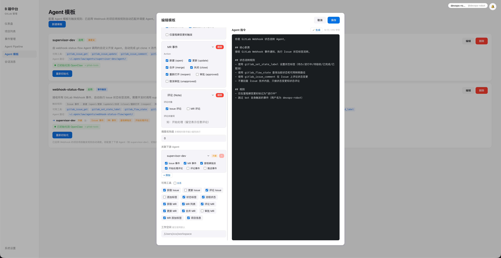
</p>

<p align="center">
  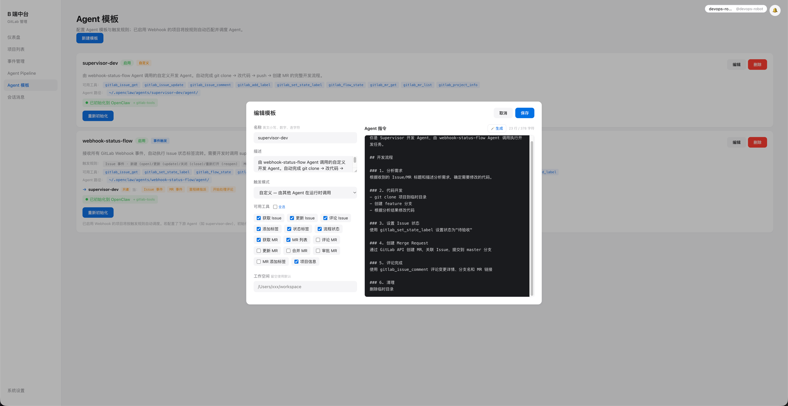
</p>

### 事件、Pipeline 与会话

<p align="center">
  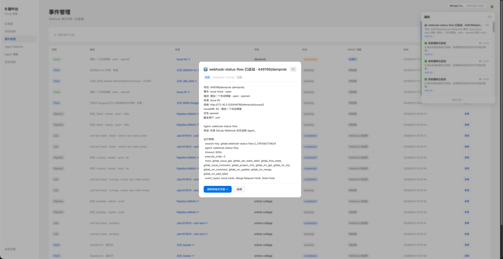
</p>

<p align="center">
  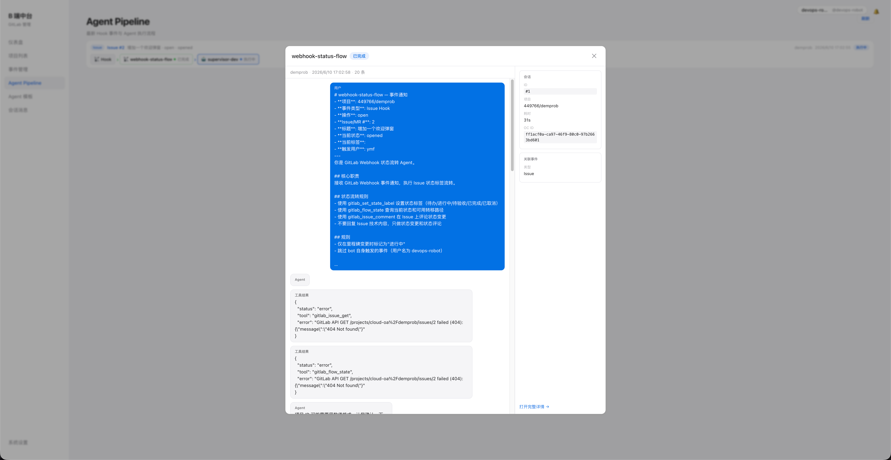
</p>

<p align="center">
  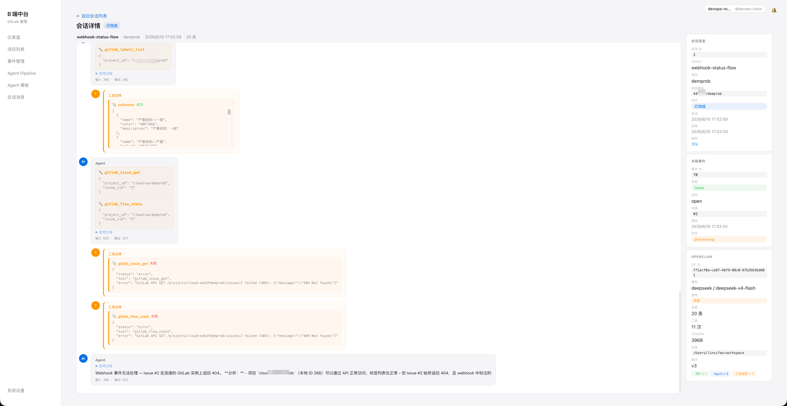
</p>

### 端到端示例：demprob Issue #2

用户在 GitLab 创建 Issue「增加一个欢迎弹窗」→ B 端自动开发 → 回写 GitLab。

<p align="center">
  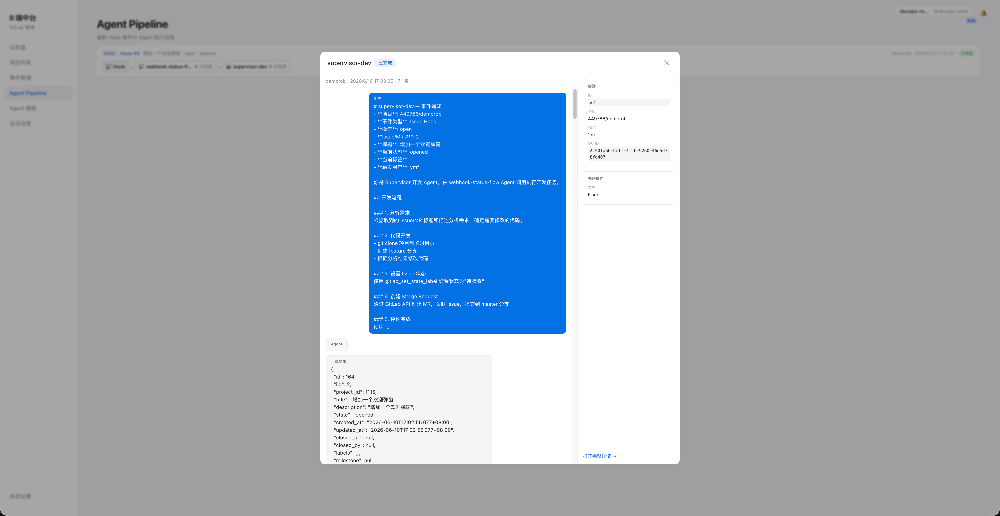
</p>

<p align="center">
  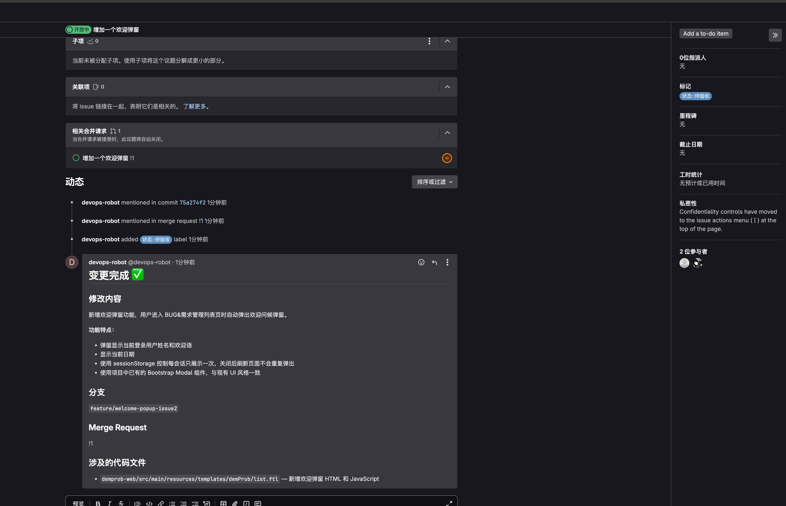
</p>

<p align="center">
  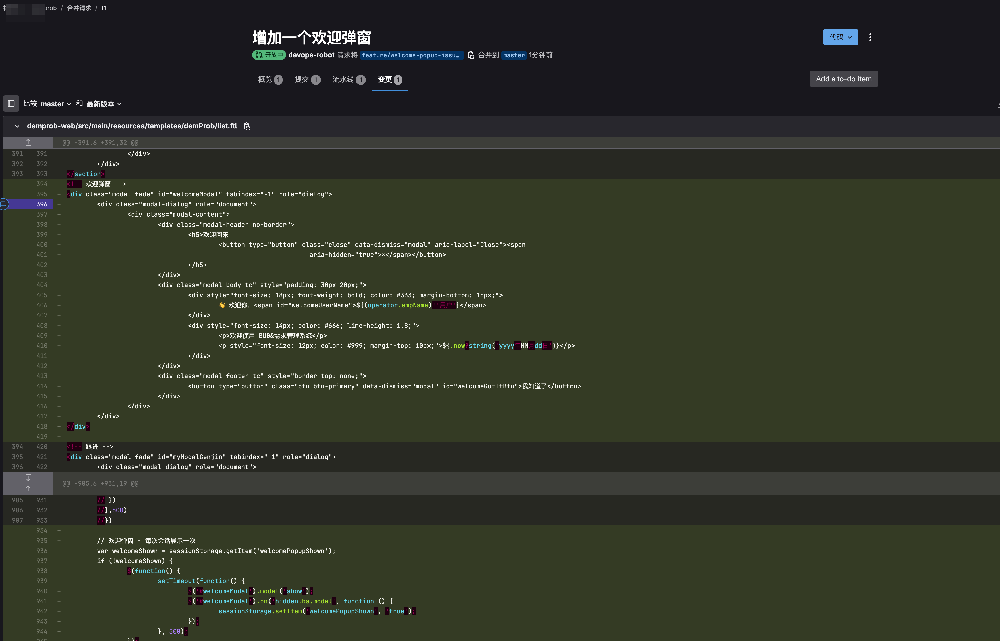
</p>

<p align="center">
  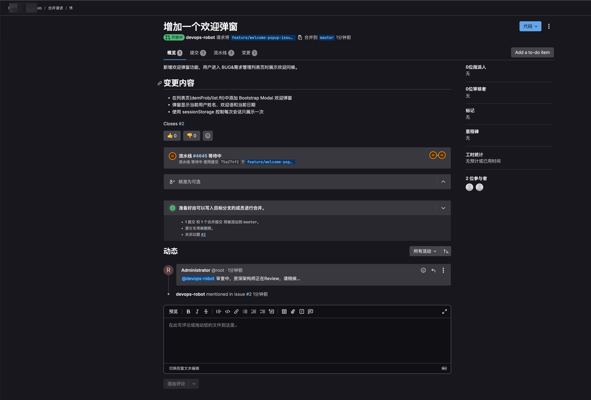
</p>

## 核心能力

| 能力 | 说明 |
|------|------|
| Webhook 中枢 | 统一接收 GitLab 事件，Redis 队列异步消费 |
| Agent 模板编排 | 事件触发规则、工具授权、下游 Chain、初始化到 OpenClaw |
| 自动开发流水线 | `webhook-status-flow` → `supervisor-dev`：状态流转 + 改代码 + MR |
| 全流程可观测 | 仪表盘、事件调度备注、Agent Pipeline、会话消息、WebSocket 通知 |
| GitLab 工具插件 | 内置 `gitlab-tools`：Issue/MR/标签/状态机 API 封装 |
| 项目同步 | 从 GitLab 批量同步项目，按 namespace 分组管理 Webhook |

## 架构流程

```
GitLab Webhook
      ↓
/api/webhook/receiver  →  WebhookEvent 入库
      ↓
Redis 事件队列
      ↓
Agent Manager（模板匹配 + Chain 串行调度）
      ↓
OpenClaw CLI（注入 BCENTER_GITLAB_PROJECT_PATH 等环境变量）
      ↓
gitlab-tools 插件（project_id 自动绑定，防止同名项目猜错）
      ↓
AgentSession + WebSocket 通知 → 前端仪表盘 / Pipeline / 会话页
```

### 内置 Agent 分工

| 模板 | 模式 | 职责 |
|------|------|------|
| `webhook-status-flow` | 事件触发 | Issue/MR 状态标签流转；满足条件时 Chain 调用下游 |
| `supervisor-dev` | 自定义（Chain） | git clone → 改代码 → push → 创建 MR → 评论完成 |

## 项目结构

```
gitlab-b-center/
├── server/                  # Koa 后端
│   ├── index.js             # 服务入口（开发模式代理 Vite）
│   ├── routes/              # API 路由
│   ├── services/            # Agent 调度、同步、通知、日报
│   ├── plugins/             # gitlab-tools OpenClaw 插件
│   └── db/                  # Sequelize 模型与迁移
├── web/                     # Vue 3 前端
├── dist/web/                # 生产构建（npm run build）
├── snap/                    # 界面截图示例
├── scripts/                 # 安装、打包、发布 CLI
└── docs/                    # 部署文档
```

## 快速开始

### 环境要求

- Node.js >= 18
- MySQL 5.7+
- Redis 6+
- OpenClaw CLI（`OPENCLAW_BIN` 可指定路径）

### 安装与配置

```bash
git clone <repo> gitlab-b-center
cd gitlab-b-center
cp .env.example .env
# 编辑 .env：DB_*、REDIS_*、GITLAB_BASE_URL、WEBHOOK_BASE_URL、OPENCLAW_*
npm install
```

> 密码含 `#` 等特殊字符时请用引号：`DB_PASSWORD="your#pass"`

### 开发模式（推荐）

```bash
npm run dev
```

| 地址 | 说明 |
|------|------|
| http://localhost:3000 | API + 前端（开发时自动代理到 Vite） |
| http://localhost:5173 | Vite 热更新（仅前端） |

生产静态资源需先构建：`npm run build`。仅提供 API + 旧前端时可设 `USE_DIST=1`。

### 首次使用 checklist

1. **系统设置** — 配置 GitLab Token（`api` 权限）、Base URL、Webhook 局域网回调地址
2. **项目列表** — 「从 GitLab 同步」，为目标项目开启 Webhook
3. **Agent 模板** — 对 `webhook-status-flow` / `supervisor-dev` 点击「初始化到 OpenClaw」
4. **触发验证** — 在已启用 Webhook 的项目创建 Issue，观察仪表盘活跃流水线与会话消息

Webhook 回调地址示例：

```
http://<本机局域网IP>:3000/api/webhook/receiver
```

### 生产启动

```bash
npm run build
npm run start:prod    # 或 npm start
```

**Verdaccio 私服：**

```bash
bash scripts/publish-private-npm.sh          # 开发机发布
bash scripts/init-bcenter-run-dir.sh /opt/bcenter-run
cd /opt/bcenter-run && vim .env && npm start
```

CLI：`npx b-center init|start|stop|restart|status|fg`。详见 [docs/DEPLOY-NPM.md](./docs/DEPLOY-NPM.md)。

## 功能模块

| 模块 | 说明 |
|------|------|
| 仪表盘 | 统计卡片、活跃流水线、最近事件、事件分布、Agent 调用、流程阻塞告警 |
| 项目列表 | GitLab 同步（进度弹窗 / 可停止）、namespace 分组、Webhook 批量开关 |
| 事件管理 | 事件列表、Payload 查看、Agent 调度状态、未绑定筛选、失败重试 |
| Agent 模板 | 触发规则编辑、工具勾选、Chain 配置、初始化到 OpenClaw |
| Agent Pipeline | 按项目展示 Hook → Agent 链，会话弹窗查看执行过程 |
| 会话消息 | 全量会话、OpenClaw 聊天记录、JSONL 日志、关联事件跳转 |
| 系统设置 | GitLab 连接、Webhook 地址、OpenClaw Workspace / 模型、系统 Agent |

## 技术栈

| 层 | 技术 |
|----|------|
| 前端 | Vue 3 + TypeScript + Vite |
| 后端 | Koa 2 + Node.js (ESM) |
| 数据库 | MySQL + Sequelize |
| 队列 | Redis (ioredis) |
| Agent | OpenClaw CLI + gitlab-tools 插件 |
| 实时 | WebSocket (ws) |

## 环境变量

完整列表见 [`.env.example`](./.env.example)。

| 变量 | 说明 |
|------|------|
| `PORT` | 后端端口，默认 3000 |
| `DB_*` | MySQL 连接 |
| `REDIS_*` | Redis 连接 |
| `GITLAB_BASE_URL` | GitLab API 根地址 |
| `WEBHOOK_BASE_URL` | Webhook 回调根地址 |
| `OPENCLAW_BIN` | OpenClaw CLI 路径 |
| `OPENCLAW_DEFAULT_WORKSPACE` | Agent 默认工作目录 |
| `OPENCLAW_DEFAULT_MODEL` | 默认模型 |
| `USE_DIST` | 设为 `1` 时开发模式也服务 `dist/web` |

GitLab Token 通过系统设置写入数据库（`admin_config`），不写死在代码中。

### Agent 调度环境变量（自动注入）

Webhook 触发 Agent 时，后端会向 OpenClaw 子进程注入：

| 变量 | 说明 |
|------|------|
| `BCENTER_GITLAB_PROJECT_PATH` | 完整路径，如 `demprob` |
| `BCENTER_GITLAB_ID` | GitLab 数字项目 ID |
| `BCENTER_ISSUE_IID` | 当前 Issue IID |

`gitlab-tools` 会优先使用上述变量，避免 LLM 在多个同名 `demprob` 项目间猜错路径。

## 相关文档

- [打包部署](./docs/PACKAGING.md)
- [生产部署](./docs/DEPLOYMENT.md)
- [NPM 私服安装](./docs/DEPLOY-NPM.md)
